# Тестування працездатності системи

***Програма для тестування - Postman.***

## Початкове наповнення бази даних

### Users:
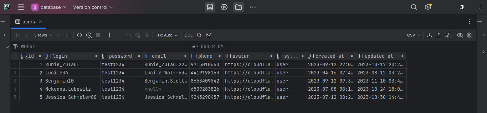

### Messages:
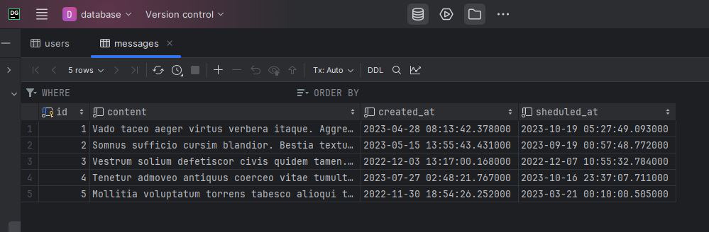

## Тест в Postman

### Users:

### Get (all)
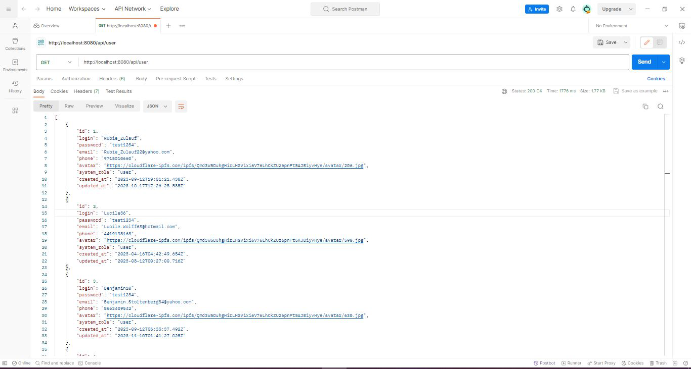
### Get (one)
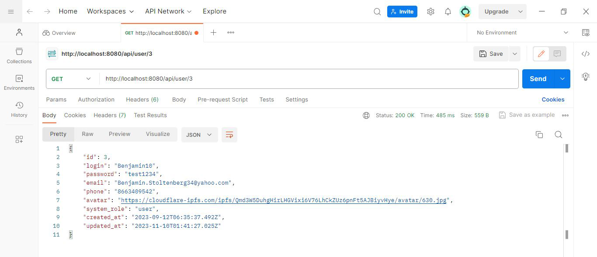
### Post
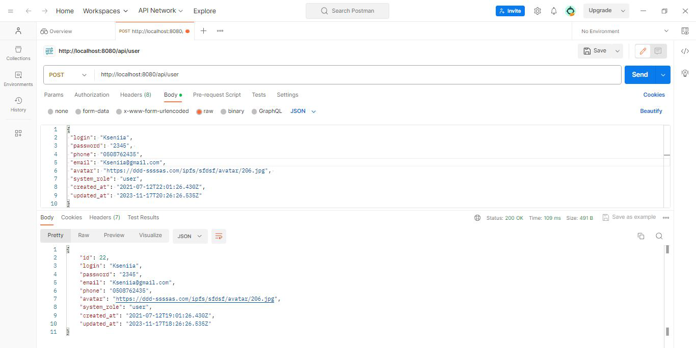
### Put
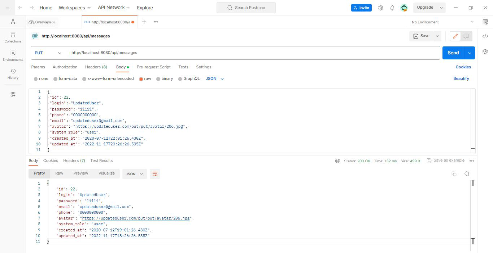
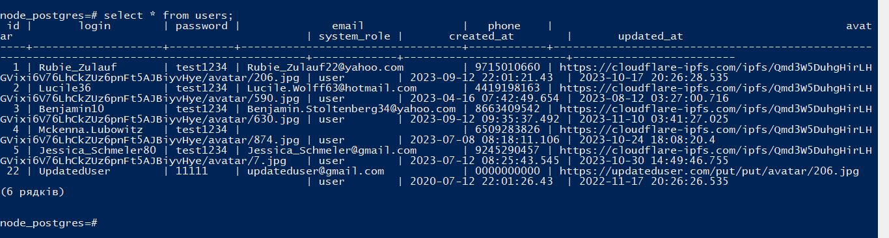
### Delete
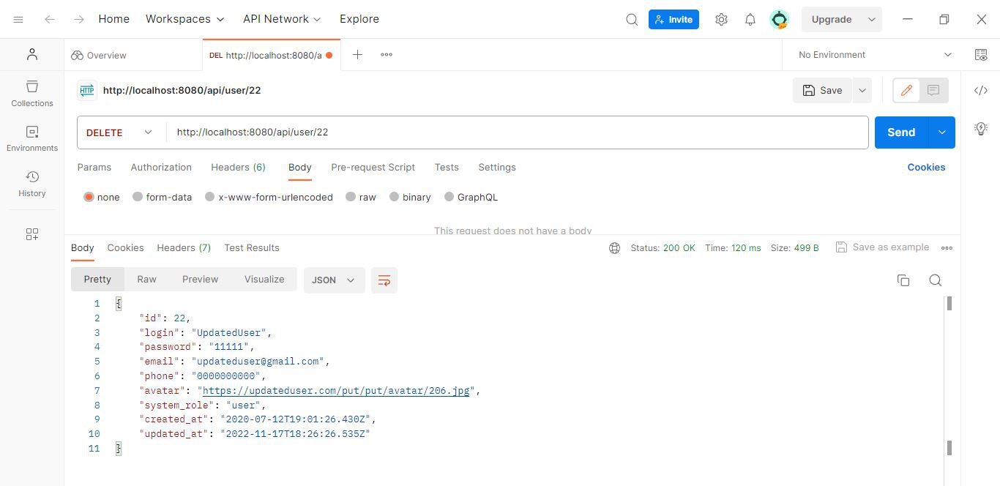
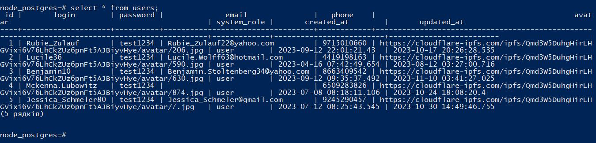

### Messages:

### Get (all)
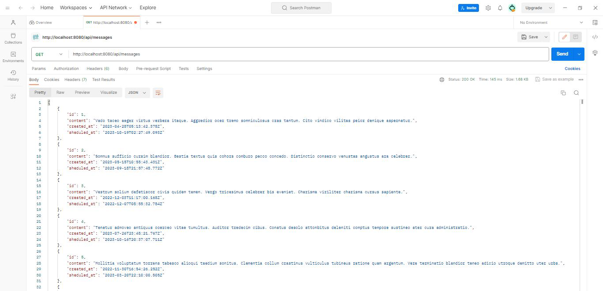
### Get (one)
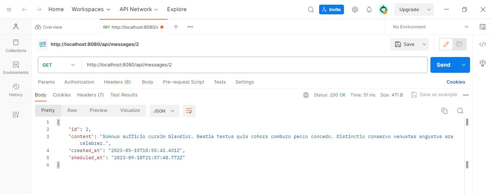
### Post
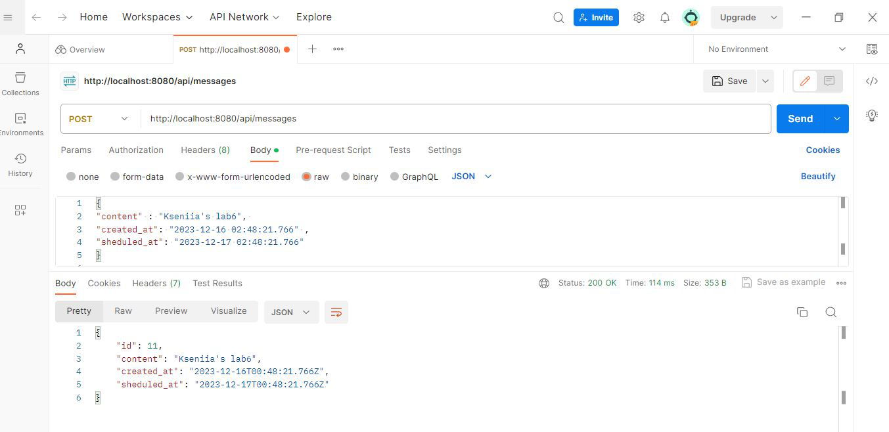
### Put
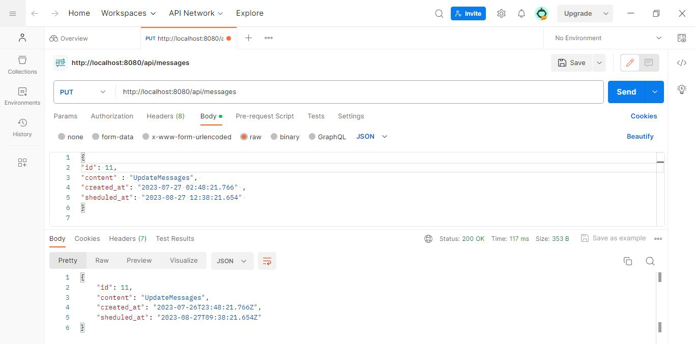
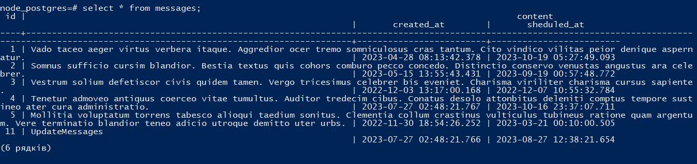
### Delete
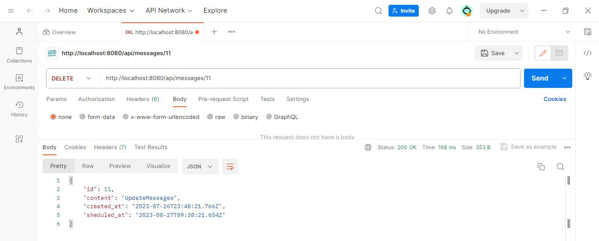
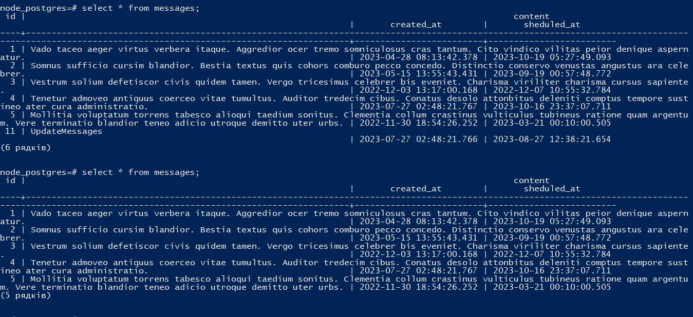

## Помилки 400 та 404

## Bad request 400
### Users:

### Messages:
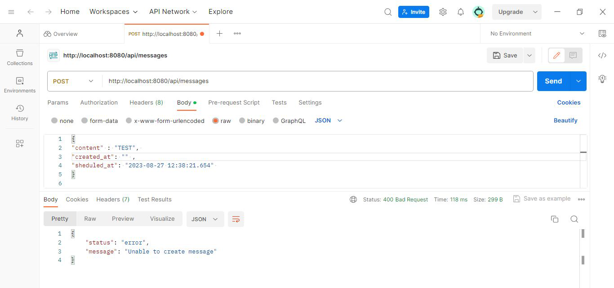

## Not  found 404
### Users:
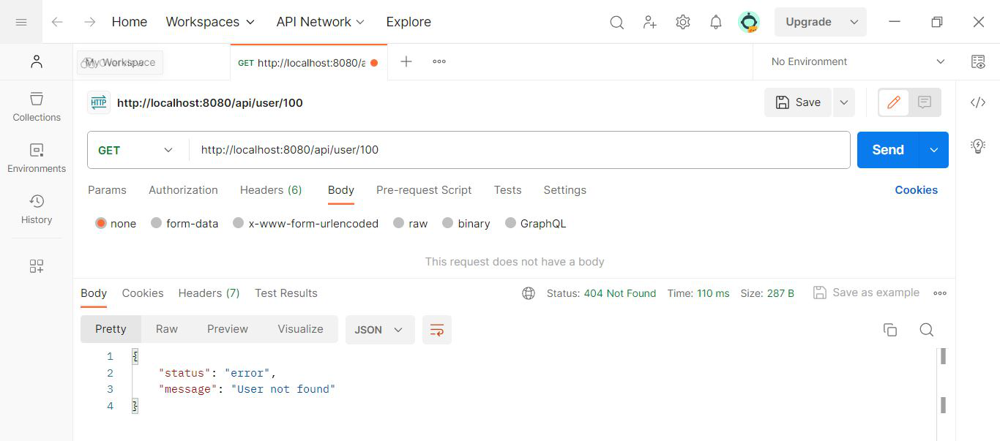
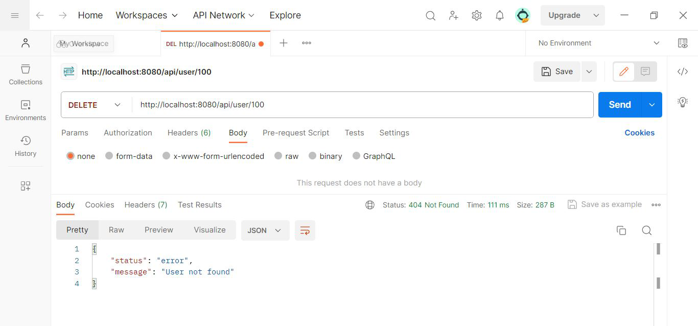
### Messages:
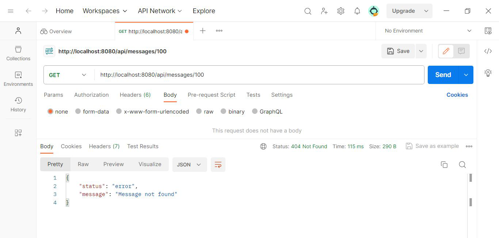
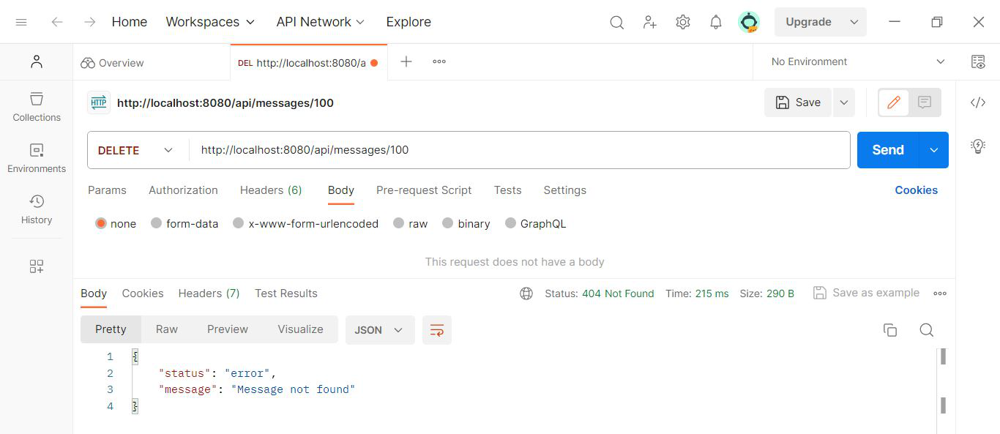

